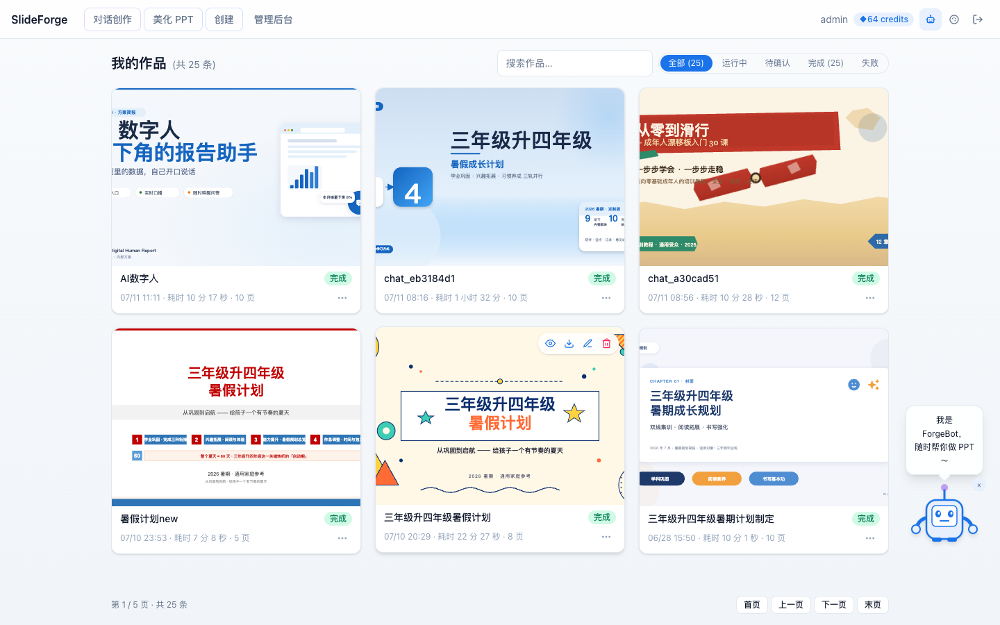
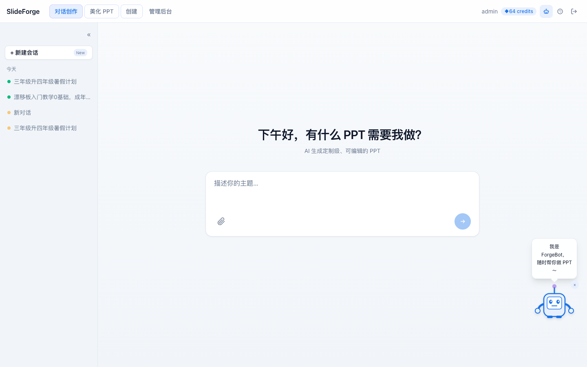
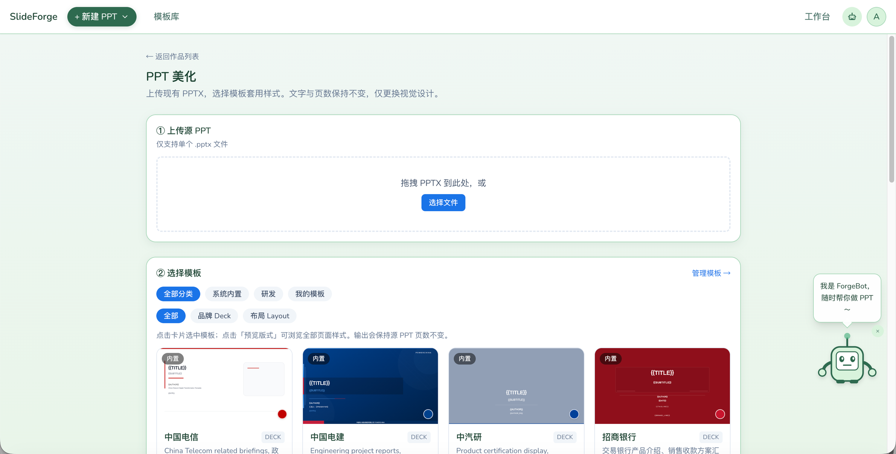
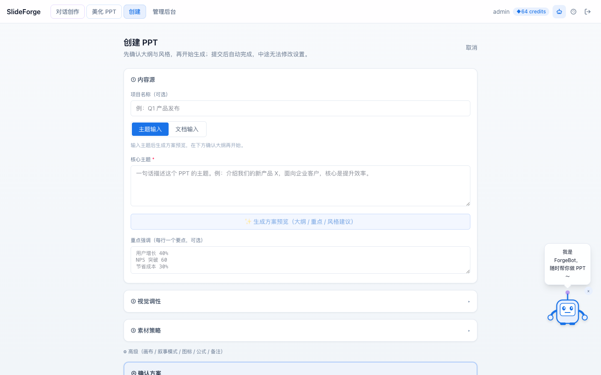
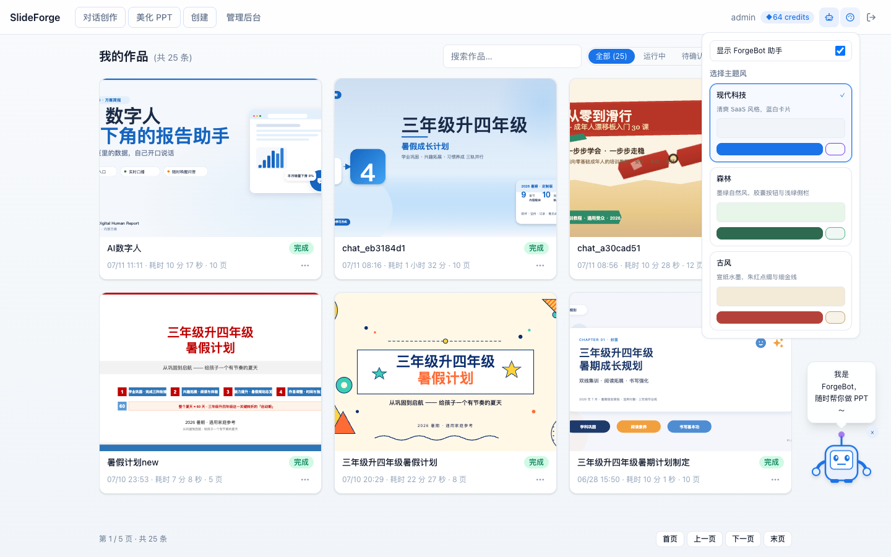
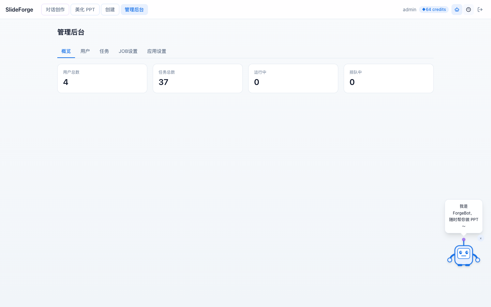

# ppt-web

`ppt-web` 是围绕上游 [ppt-master](https://github.com/hugohe3/ppt-master) 的 Web 化封装：ppt-master 提供 PPT 生成 agent + skill 流水线；本项目提供开箱即用的在线服务（鉴权、多用户、任务调度、Docker 隔离执行）。

**项目定位**：个人探索实验——探索如何以可管控的方式利用 Claude Code 的 agent 能力：每个 PPT 任务在独立 Docker 容器内运行并在结束后销毁，在保护宿主与用户隐私的前提下交付可下载的 `.pptx`。

- 设计摘要：[DESIGN.md](./DESIGN.md)
- 完整文档：[Docs/README.md](./Docs/README.md)
- phase0 验证报告：[phase0/REPORT.md](./phase0/REPORT.md)

## 核心能力

围绕「生成可编辑 .pptx」展开：三种创作路径共用同一任务调度与 Docker 执行引擎，输入与交互方式不同。

### 生成 PPT

| 方式 | 入口 | 输入 | 适用场景 |
|------|------|------|----------|
| 对话创作 | 顶栏点击 **「对话创作」**（`/chat`） | 自然语言描述；可附 PDF/DOCX 等文档 | 需求尚不清晰，通过多轮对话确认大纲与风格后生成 |
| 美化 PPT | 顶栏点击 **「美化 PPT」**（`/jobs/beautify`） | 已有 `.pptx` + 选择内置模板 | 内容已定，**不改文字与页数**，仅套用新视觉样式 |
| 创建 | 顶栏点击 **「创建」**（`/jobs/new`） | 主题描述或上传文档；可填大纲、风格、页数等选项 | 需求较明确，用表单一次性配置后生成 |

> **怎么选？** 想边聊边定方案 → 对话创作；已有稿子只想换样子 → 美化 PPT；参数都想自己控 → 创建。

### 配套能力

| 能力 | 入口 | 作用 |
|------|------|------|
| ForgeBot 助手 | 顶栏机器人图标；右下角悬浮助手 | 播报生成进度，空闲时引导创作 |
| 主题换肤 | 顶栏调色板图标 | 切换 6 套界面皮肤与明暗模式 |
| 管理后台 | 顶栏 **「管理后台」**（`/admin`，仅管理员） | 用户、任务、Docker Runner、LLM 模型配置 |

作品列表（`/`）支持状态筛选、搜索、分页；卡片悬停可预览、下载、编辑、删除。

## 系统架构


> 可编辑源文件：[Docs/architecture/ppt-web-architecture.drawio](./Docs/architecture/ppt-web-architecture.drawio)

## 界面预览

> 更新截图：`cd webui && npm run build` → 启动服务 → `python3 scripts/screenshot_readme.py`

### 作品列表



登录后的主页：卡片网格展示作品，顶部可按状态筛选与搜索，右下角为 ForgeBot 助手。

### 对话创作



从顶栏 **「对话创作」** 进入：左侧会话栏 + 右侧创作区，输入主题或上传文档，通过多轮对话确认需求、大纲与视觉风格后一键生成。

### 美化 PPT



从顶栏 **「美化 PPT」** 进入：上传已有 `.pptx` 并选择内置模板，文字与页数保持不变，仅更换视觉设计。

### 创建



从顶栏 **「创建」** 进入结构化表单：主题或文档作为内容源，可配置视觉调性、素材策略与高级选项；支持 AI 智能填充（需在 Admin 配置 LLM）。

### 主题与 ForgeBot



顶栏调色板打开主题面板：切换 6 套皮肤，并可开关 ForgeBot 助手显示。

### 管理后台



管理员可查看概览、管理用户与任务、调整 Docker Runner 参数，以及配置 Web 端 LLM（智能填充/优化依赖此项）。

## 快速开始

按顺序执行。基础设施（MySQL、ppt-runner 镜像）须先就绪。

### 前置依赖

| 依赖 | 版本建议 | 用途 |
|------|----------|------|
| Docker | 最新稳定版 | MySQL 容器 + 每 job 执行容器（**必需**） |
| Python | 3.11+ | 后端 API |
| Node.js | 18+ | 前端构建 |
| git | — | clone 仓库与 ppt-master |

### 1. 启动 MySQL（Docker）

```bash
docker run -d --name ppt-mysql \
  -p 3306:3306 \
  -e MYSQL_ROOT_PASSWORD=root \
  -e MYSQL_DATABASE=pptweb \
  -e MYSQL_USER=pptweb \
  -e MYSQL_PASSWORD=pptweb \
  -v ppt-mysql-data:/var/lib/mysql \
  mysql:8.0 --character-set-server=utf8mb4 --collation-server=utf8mb4_unicode_ci
```

库字符集必须是 **utf8mb4**（不是 utf8，否则 emoji 会被截断）。

### 2. 构建 ppt-runner 镜像

每个 PPT 任务在独立 Docker 容器内执行；镜像构建时会**自动 clone 上游 ppt-master**：

```bash
bash docker/ppt-runner/build.sh
# 首次约 5–10 分钟，产出 ppt-runner:latest（~1.5GB）
```

可选环境变量：`PPT_MASTER_REPO`、`PPT_MASTER_REF`（默认 `main`）。

### 3. 克隆本仓库

```bash
git clone <repo-url>
cd ppt-web
```

### 4. Python 环境 + 配置 .env

```bash
python3 -m venv .venv
.venv/bin/pip install -r backend/requirements.txt

cp .env.example .env
# 编辑 DB_URL、PPT_WEB_JWT_SECRET、ANTHROPIC_AUTH_TOKEN 等
```

### 5. 准备 ppt-master（本地开发）

后端模板 API 与 runner 常量依赖仓库根目录下的 `ppt-master/`：

```bash
bash scripts/ensure-ppt-master.sh
```

`dev-web.sh` 启动前也会自动执行此脚本。

### 6. 构建前端

```bash
cd webui && npm install && npm run build && cd ..
```

产物在 `webui/dist/`，由 FastAPI 托管。

### 7. 启动服务

```bash
bash scripts/dev-web.sh
# 或：.venv/bin/uvicorn backend.main:app --host 127.0.0.1 --port 8765
```

首次启动会自动跑 DB 迁移。默认管理员：**admin / admin**（生产环境请立即改密）。

### 8. 验证

```bash
open http://127.0.0.1:8765/
curl http://127.0.0.1:8765/api/health
```

**前端开发（HMR）：**

```bash
# 终端 1 — API
.venv/bin/uvicorn backend.main:app --host 127.0.0.1 --port 8765

# 终端 2 — Vite 热更新（勿占用 8765）
cd webui && npm run dev
# 打开 http://127.0.0.1:5173 ，/api 代理到 8765
```

## ppt-master 上游依赖

生成引擎来自上游开源项目 **[hugohe3/ppt-master](https://github.com/hugohe3/ppt-master)**（skill 工作流 + Python 脚本）。ppt-web **不重写**该流水线，而是在 Docker 容器内通过 Claude CLI 驱动它。

| 场景 | 获取方式 |
|------|----------|
| Docker 镜像 | `bash docker/ppt-runner/build.sh` 构建时 `git clone` |
| 本地 API / 模板目录 | `bash scripts/ensure-ppt-master.sh` |

升级上游版本：

```bash
# 本地开发目录
cd ppt-master && git pull && cd ..

# 或指定 ref 重建镜像
PPT_MASTER_REF=main bash docker/ppt-runner/build.sh
```

## Job 隔离（摘要）

每个生成任务在临时容器内运行，结束后自动销毁（`--rm`）。uvicorn 进程通过 `docker run` 拉起 `ppt-runner:latest`，挂载 per-user 数据目录，限制内存/CPU/超时。

主要环境变量见 [`.env.example`](./.env.example)（`MAX_CONCURRENT_JOBS`、`DOCKER_RUNNER_*` 等）。详见 [Docs/deployment.md](./Docs/deployment.md)。

## 其他能力（摘要）

- **错误文案友好化**：`backend/runner/errors.py` 将常见机器错误翻成用户可读文案；详见 [Docs/development.md](./Docs/development.md)。
- **失败重试**：`POST /api/jobs/{id}/retry` 原地重跑，沿用原 prompt 与选项。
- **完成后编辑（Revisions）**：对 `done` 任务提交逐页修改意见，生成 revision job；详见 [Docs/product.md#完成后编辑-revisions](./Docs/product.md#完成后编辑-revisions)。
- **Admin**：用户/quota、全站任务、Runner 与 LLM 模型配置；见 [Docs/product.md](./Docs/product.md#管理后台admin)。

## 目录结构

```
ppt-web/
├── README.md
├── DESIGN.md
├── Docs/                  # 完整文档
├── images/                # README 截图与架构图
├── backend/               # FastAPI 后端
├── webui/                 # React 前端
├── docker/ppt-runner/     # 每 job 容器镜像
├── scripts/               # dev-web、ensure-ppt-master、截图脚本等
├── ppt-master/            # 本地 clone 的上游引擎（gitignore 或 ensure 脚本生成）
└── data/                  # 运行时用户数据（gitignored）
```

## 跑测试

```bash
# 后端单测（示例）
.venv/bin/python -m unittest backend.tests.test_job_list_filters -v

# 端到端 smoke（需要 Docker + Claude API，会消耗 token）
.venv/bin/python backend/scripts/smoke.py "写一份 4 页 Python 简介 PPT"
```

## 文档

| 文档 | 说明 |
|------|------|
| [Docs/README.md](./Docs/README.md) | 文档导航 |
| [DESIGN.md](./DESIGN.md) | 设计摘要与实现状态 |
| [Docs/product.md](./Docs/product.md) | 产品、用户指南、Revisions |
| [Docs/architecture.md](./Docs/architecture.md) | 架构与 SSE |
| [Docs/development.md](./Docs/development.md) | 开发指南 |
| [Docs/deployment.md](./Docs/deployment.md) | 部署 |
